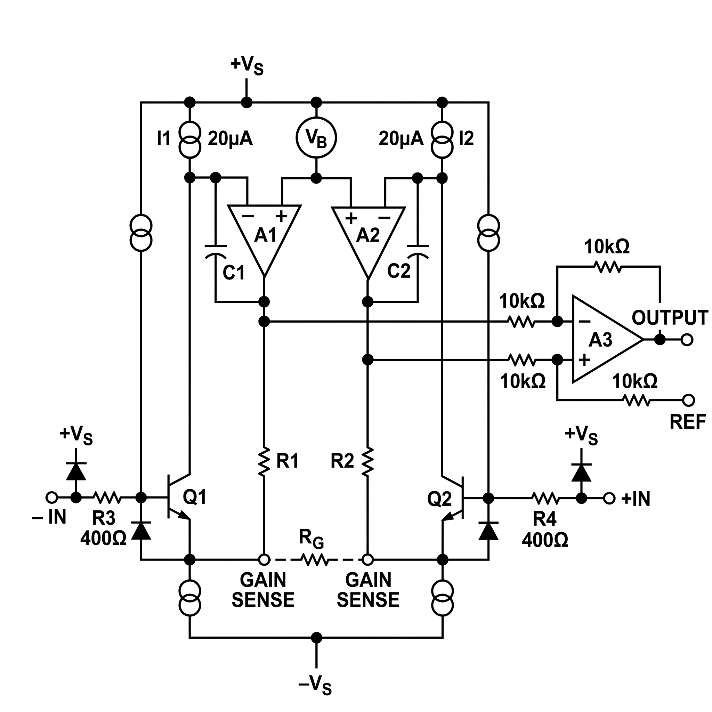

# Low-Cost Electronic Platform for Electrooculography (EOG) Signals

[](https://doi.org/10.46904/eea.26.74.2.1108016)
[](https://doi.org/10.46904/eea.26.74.2.1108016)

**Peer-Reviewed Publication**  
Authors: Abdulaziz K.A. Hatem, Ahmed M.A.S. AlKadhi, Mohammed A A. Qasem, Khaled A.M. Farhan, and Nasr Kaid Ali AL-Audi  
*Electrotehnica, Electronica, Automatica (EEA)*, vol. 74, no. 2, pp. 130-137, 2026. ISSN 1582-5175.

---

## Overview

This repository shows the hardware circuit we built to record eye movements (Electrooculography or EOG). We designed and tested this low-cost circuit during our undergraduate studies at the Biomedical Engineering Department, University of Science and Technology in Aden, Yemen.

When you move your eyes, they create a very small electrical signal on your skin. Our circuit reads this signal, makes it bigger (amplification), and cleans the noise (filtering) so a computer can understand it. This hardware was the main piece of our graduation project: an eye-controlled wheelchair and Arabic keyboard.

---

## Circuit Design

The circuit uses five stages to process the signal:

```
[ Electrodes on Face ]
            |
            v
[ 1. Main Amplifier (AD620) ]       ---> Increases the signal 6 times
            |
            v
[ 2. High-Pass Filter (TL072) ]     ---> Removes slow DC voltage drifting (0.8 Hz)
            |
            v
[ 3. Low-Pass Filter (TL072) ]      ---> Removes fast noise from face muscles (30 Hz)
            |
            v
[ 4. Notch Filter (50 Hz) ]         ---> Removes electrical noise from the room's power
            |
            v
[ 5. Final Amplifier (TL072) ]      ---> Increases signal up to 100 times
            |
            v
[ Level Shifter (+2.5V) ]           ---> Pushes the voltage up so Arduino can read it (0-5V)
            |
            v
[ Arduino (ATmega328P) ]            ---> Sends data to laptop using USB
```

---

## Signal Quality

The pictures below show how the signal looks on our testing equipment before and after filtering.

### 50 Hz Noise (Before Notch Filter)

*Figure 1: Oscilloscope picture showing heavy 50 Hz electrical noise before the notch filter is applied.*

### Clean EOG Signal (After 30 Hz Low-Pass)

*Figure 2: Clean eye movement signal after the noise is removed by our active filter.*

### Blink Detection

*Figure 3: Real-time EOG signal acquisition in MATLAB displaying threshold-based blink detection.*

---

## Hardware Pictures

### Circuit Schematic

*Figure 4: The full circuit diagram of the EOG hardware.*

### AD620 Amplifier

*Figure 5: The AD620 chip used for the first stage.*

### Testing Setup

*Figure 6: Our breadboard circuit connected to the testing equipment and electrodes.*

---

## Technical Details

| Parameter | Value |
| :--- | :--- |
| **Input Signal** | 50–3500 μV (eye movement potential) |
| **Pre-Amplifier** | AD620, Gain = 6x |
| **High-Pass Filter** | 0.8 Hz (removes baseline wander) |
| **Low-Pass Filter** | 30 Hz (removes high noise) |
| **Notch Filter** | 50 Hz (removes powerline noise) |
| **Total Gain** | Up to 100x |
| **Power Supply** | Two 9V batteries (+9V, -9V, GND) |
| **Cost** | Less than $15 USD |

---

## Related Project

This circuit is the hardware part of our complete system:
- **[eog-assistive-hci-keyboard](https://github.com/Abdulaziz-kh-Hatem/eog-assistive-hci-keyboard):** Our graduation project (100% Grade). It uses this hardware to control a virtual Arabic keyboard and a wheelchair.

---

## How to Cite

If this circuit design helps you, please cite our published paper:

```bibtex
@article{hatem2026eog,
  title   = {Design and Development of a Low-Cost Electronic Platform for Electrooculography Signals Acquisition},
  author  = {Hatem, Abdulaziz K.A. and AlKadhi, Ahmed M.A.S. and Qasem, Mohammed A A. and Farhan, Khaled A.M. and AL-Audi, Nasr Kaid Ali},
  journal = {Electrotehnica, Electronica, Automatica (EEA)},
  volume  = {74},
  number  = {2},
  pages   = {130--137},
  year    = {2026},
  issn    = {1582-5175},
  doi     = {10.46904/eea.26.74.2.1108016}
}
```
