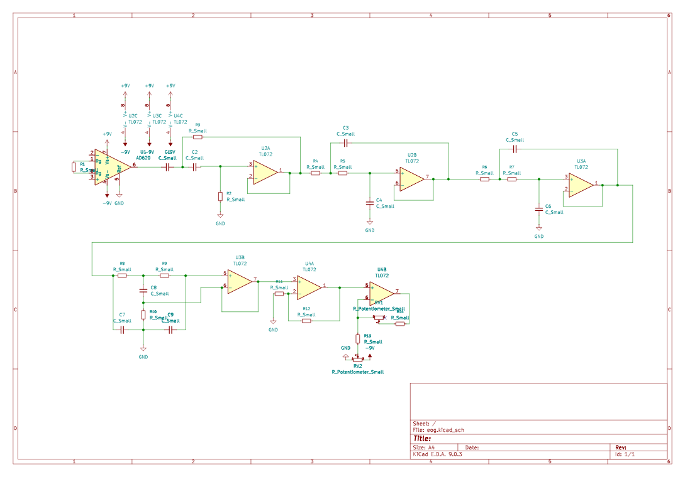
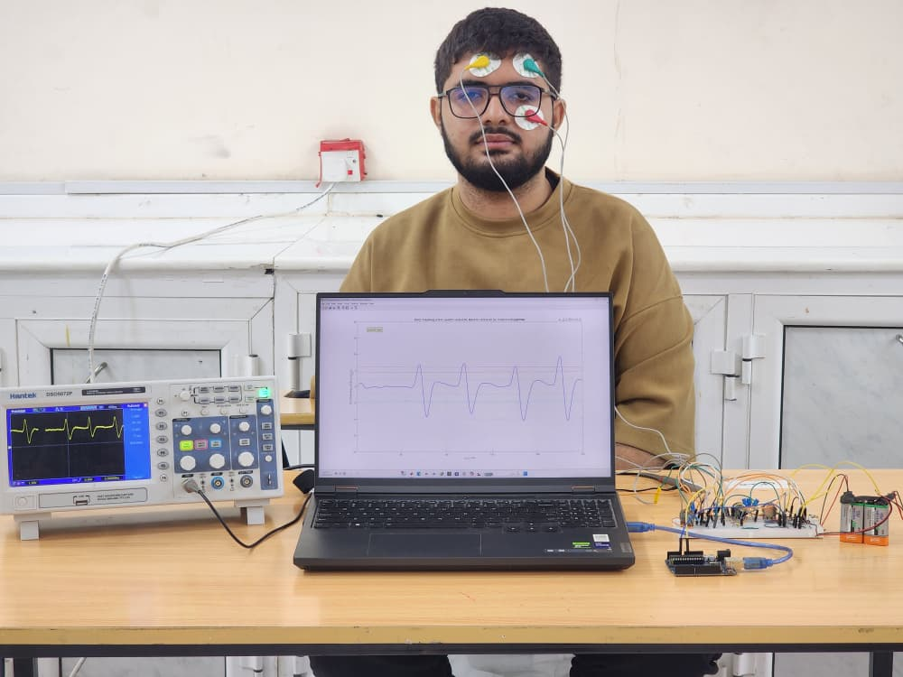
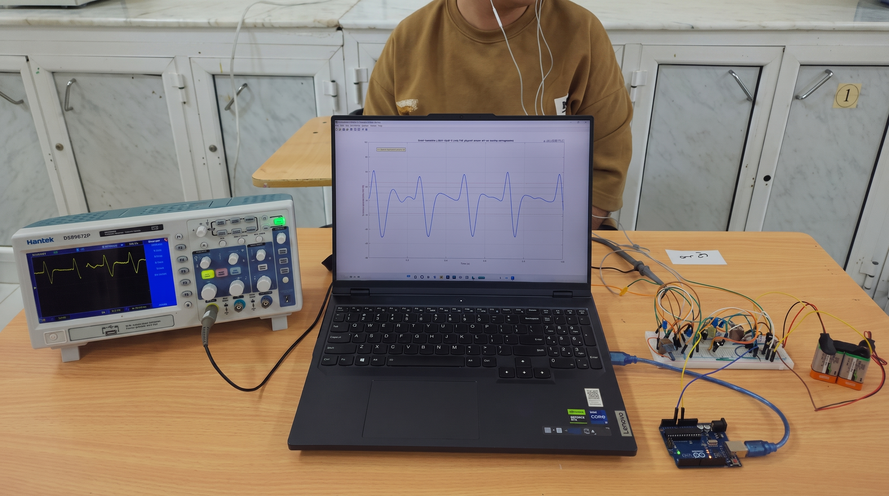
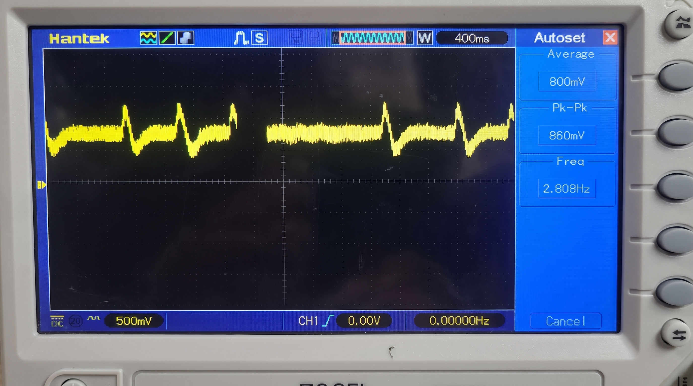
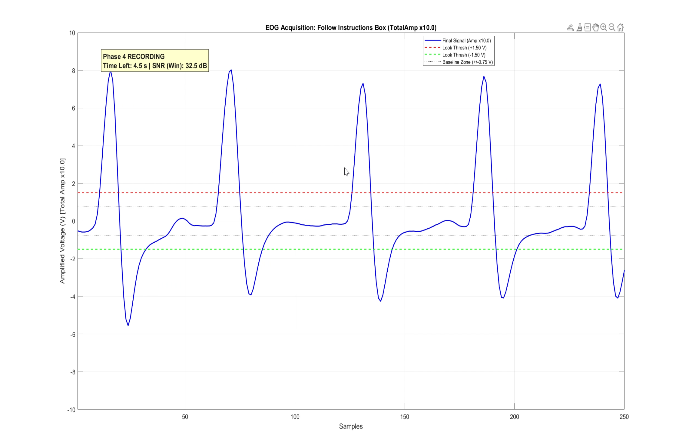

# Low-Cost EOG Acquisition Platform

[](https://doi.org/10.46904/eea.26.74.2.1108016)
[](https://doi.org/10.46904/eea.26.74.2.1108016)
[](https://youtu.be/ZO9QT6c9rzA)

This repository contains the hardware circuit and software we developed to record eye movement signals (Electrooculography - EOG). We designed and built this low-cost system (< $15 USD) during our biomedical engineering undergraduate studies at the University of Science and Technology, Aden, Yemen.

The platform detects vertical eye movements and blinks, serving as the hardware interface for our graduation project: an **eye-controlled smart wheelchair and Arabic virtual keyboard**.

The full clinical study, mathematical modeling, and theoretical derivations are published in the *EEA Journal* ([DOI: 10.46904/eea.26.74.2.1108016](https://doi.org/10.46904/eea.26.74.2.1108016)).

---

## Live Video Demonstration

Watch the live hardware demonstration showing the clean analog EOG signal responding in real time to eye movements (looking up and blinking) on the oscilloscope before any digital software processing:

[](https://youtu.be/ZO9QT6c9rzA)

> **[Click here to watch the demonstration on YouTube](https://youtu.be/ZO9QT6c9rzA)**  
> *Demonstrated by Abdulaziz Hatem — showing the real-time analog signal cleanly capturing blinks and upward gaze on the oscilloscope.*

---

## Hardware & Circuit Overview

Eye movements generate tiny microvolt electrical potentials on the skin around the eyes. Our analog circuit amplifies and cleans this signal so an Arduino microcontroller can read it.

```
[ Electrodes on Face ]
          │
          ▼
[ 1. Instrumentation Pre-Amp (AD620) ]    ──► Gain = 495×, high noise rejection
          │
          ▼
[ 2. Active Band-Pass Filter (TL072) ]    ──► 1.6 Hz to 16 Hz (isolates eye signals, Gain = 10×)
          │
          ▼
[ 3. Active Low-Pass Filter (TL072) ]     ──► 16 Hz cutoff (Gain = 2×, removes muscle tremor & hum)
          │
          ▼
[ 4. Level Shifter & Variable Gain ]      ──► Shifts signal to 0–5V range for Arduino ADC
          │
          ▼
[ Arduino Uno (ADC) ]                     ──► Samples at 250 Hz, streams over USB (115200 baud)
          │
          ▼
[ MATLAB GUI & DSP ]                      ──► Real-time display, filtering, and speller/wheelchair control
```

### Key Hardware Points
- **Electrodes**: Small pediatric Ag/AgCl adhesive gel electrodes placed above the eyebrow ($V+$), below the eye ($V-$), and ground on the forehead.
- **Amplification**: AD620 instrumentation amplifier with $R_G = 100\,\Omega$ ($495\times$ gain), followed by op-amp stages for a total gain up to $\approx 10,000\times$.
- **Filtering**: Analog active bandpass ($1.6 - 16\text{ Hz}$) and low-pass ($16\text{ Hz}$) remove slow DC baseline drift, muscle (EMG) noise, and powerline hum.
- **Safety**: Powered by two 9V batteries ($\pm 9\text{ V}$), completely isolating the user from mains electricity.

---

## Circuit Schematic & Setup Photos

### 1. Circuit Schematic
The analog front-end schematic (designed in KiCad):


### 2. Electrode Placement
Placement of pediatric electrodes on the face for vertical EOG recording:


### 3. Experimental Test Setup
Our laboratory test bench showing the breadboard circuit, dual 9V batteries, Arduino Uno, Hantek DSO5072P oscilloscope, and laptop running real-time MATLAB acquisition:


---

## Signal Validation & Filtering

### 50 Hz Mains Noise (Before Analog Filtering)
At the pre-amplifier stage before active filtering, the raw signal picked up heavy 50 Hz electrical noise from the room's AC wiring:

  
*Raw signal on the oscilloscope (400 ms/div, 500 mV/div) showing 50 Hz powerline hum riding on blink peaks before active filtering.*

Our active filter stages completely eliminated this 50 Hz hum directly in hardware. The clean analog waveform is visible on the oscilloscope screen in the bench photo above and is demonstrated live in our [YouTube Video](https://youtu.be/ZO9QT6c9rzA).

### Processed Signal in MATLAB
Once digitized by the Arduino, MATLAB applies light digital smoothing (moving average) and baseline correction for clear peak detection:

  
*Clean, real-time EOG signal in MATLAB showing distinct peaks for blinks and eye movements.*

---

## Quick Start / How to Run

### 1. Arduino Firmware
1. Connect the analog circuit output to pin `A0` of an Arduino Uno.
2. Open [`src/arduino/eog_acquisition.ino`](src/arduino/eog_acquisition.ino) in the Arduino IDE.
3. Select your Arduino Uno board and COM port, then click **Upload** (Baud rate: `115200`).

### 2. MATLAB Real-Time Acquisition
1. Open MATLAB.
2. In [`src/matlab/eog_realtime_acquisition.m`](src/matlab/eog_realtime_acquisition.m), set your COM port:
   ```matlab
   arduinoPort = 'COM3'; % Change to your Arduino COM port (e.g., 'COM3', 'COM7')
   ```
3. Run the script to view real-time eye movements, blinks, and test the virtual keyboard interface.  
   *(Note: Wheelchair Bluetooth is optional — if not connected, the script runs in standalone acquisition mode).*

---

## Related Projects

- **[eog-assistive-hci-keyboard](https://github.com/Abdulaziz-kh-Hatem/eog-assistive-hci-keyboard)**: Our complete graduation project (awarded 100% distinction), which uses this hardware to drive an Arabic virtual speller and wheelchair.
- **[ecg-acquisition-platform](https://github.com/Abdulaziz-kh-Hatem/ecg-acquisition-platform)**: Low-cost ECG acquisition platform for cardiac monitoring.

---

## Published Paper & Citation

For complete theoretical derivations, circuit calculations, and clinical test statistics, please see our peer-reviewed paper:

> Abdulaziz K.A. Hatem, Ahmed M.A.S. AlKadhi, Mohammed A.A. Qasem, Khaled A.M. Farhan, Nasr Kaid Ali AL-Audi,  
> *"Design and Development of a Low-Cost Electronic Platform for Electrooculography Signals Acquisition"*,  
> **Electrotehnică, Electronică, Automatică (EEA)**, 2026, vol. 74, no. 2, pp. 130–137. ISSN 1582-5175.  
> **DOI**: [10.46904/eea.26.74.2.1108016](https://doi.org/10.46904/eea.26.74.2.1108016)

```bibtex
@article{hatem2026eog,
  title   = {Design and Development of a Low-Cost Electronic Platform for Electrooculography Signals Acquisition},
  author  = {Hatem, Abdulaziz K.A. and AlKadhi, Ahmed M.A.S. and Qasem, Mohammed A.A. and Farhan, Khaled A.M. and AL-Audi, Nasr Kaid Ali},
  journal = {Electrotehnic\u{a}, Electronic\u{a}, Automatic\u{a} (EEA)},
  volume  = {74},
  number  = {2},
  pages   = {130--137},
  year    = {2026},
  issn    = {1582-5175},
  doi     = {10.46904/eea.26.74.2.1108016}
}
```
