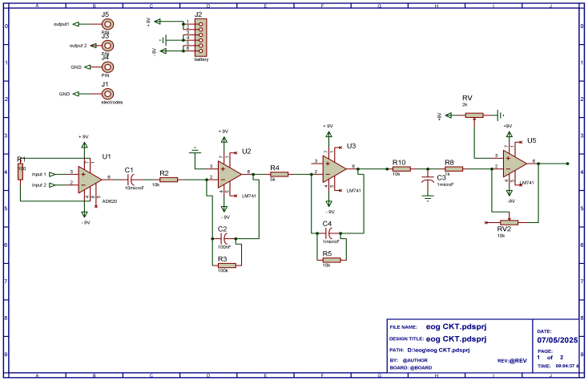
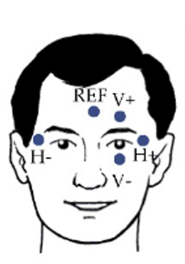
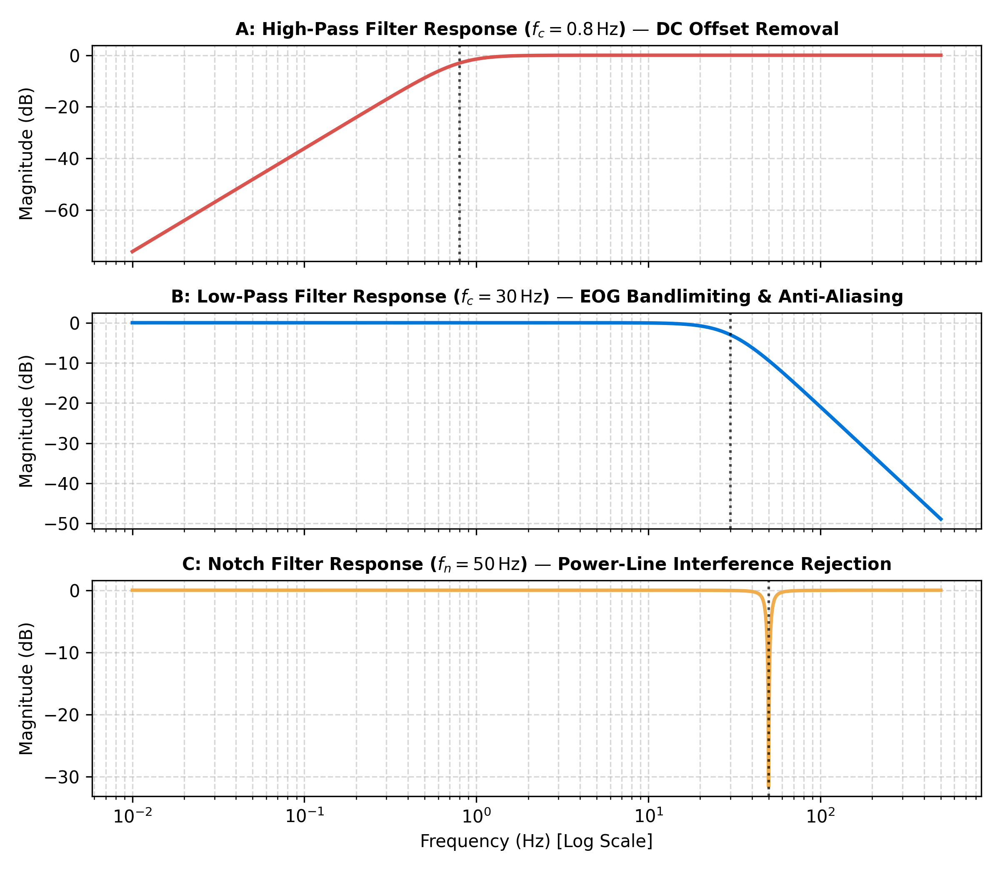
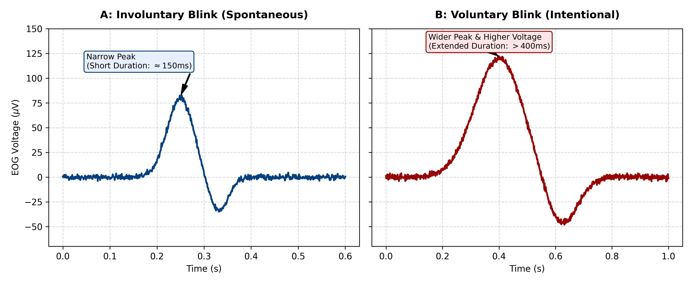
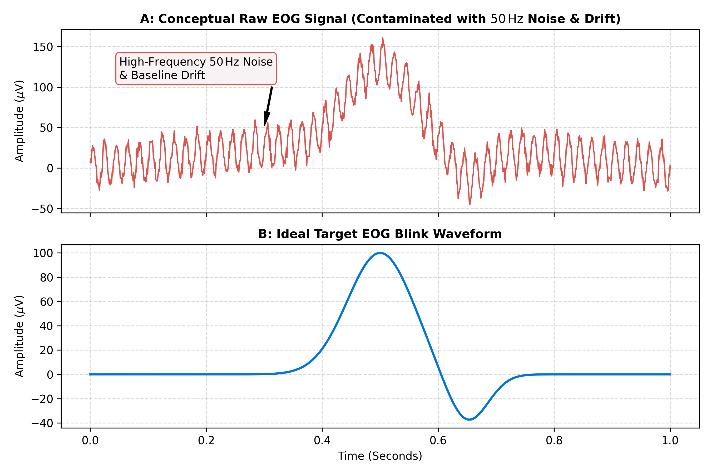
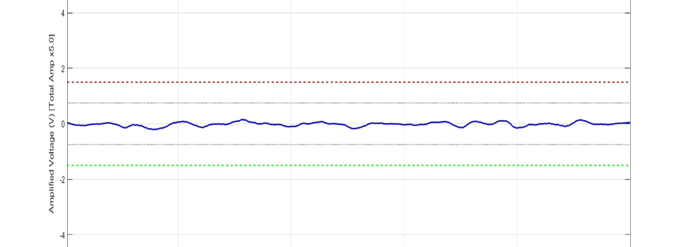
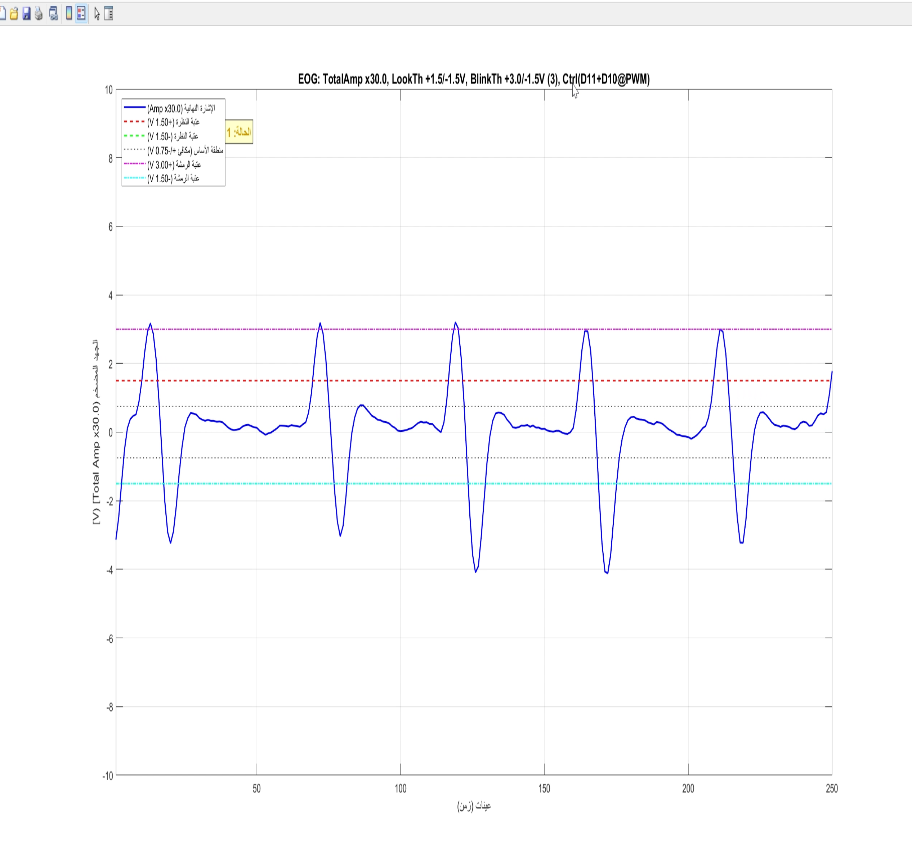
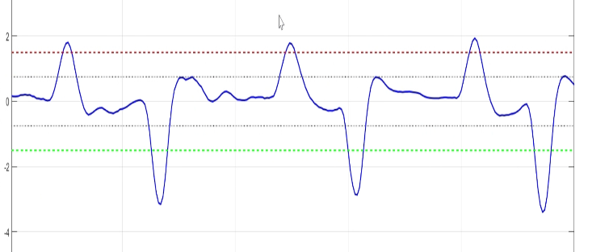
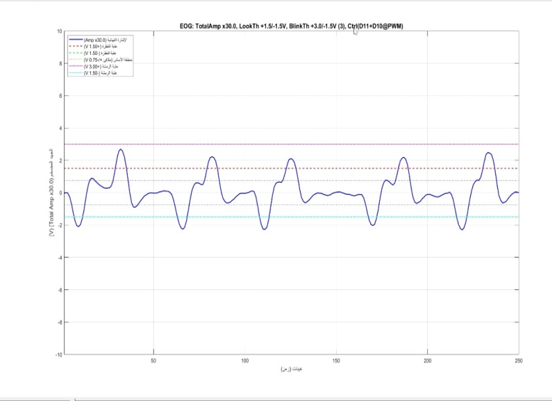

# Low-Cost Electronic Platform for Electrooculography (EOG) Signals Acquisition

[](https://doi.org/10.46904/eea.26.74.2.1108016)
[](https://doi.org/10.46904/eea.26.74.2.1108016)
[](#circuit-design)
[](#experimental-results--statistical-analysis)

**Peer-Reviewed Publication**  
Authors: Abdulaziz K.A. Hatem, Ahmed M.A.S. AlKadhi, Mohammed A A. Qasem, Khaled A.M. Farhan, and Nasr Kaid Ali AL-Audi  
*Electrotehnică, Electronică, Automatică (EEA)*, 2026, vol. 74, no. 2, pp. 130–137. ISSN 1582-5175.  
Department of Biomedical Engineering, Faculty of Engineering, University of Science and Technology, Aden, Yemen.

---

## Overview

Electrooculography (EOG) is an electrophysiological measurement technique based on the permanent electrical dipole of the human eye, known as the **cornea-retinal potential (CRP)**. The cornea is positively polarized relative to the retina, generating a bioelectric potential field ranging between **50 μV and 3500 μV**. When the eye moves or blinks, this dipole changes its orientation relative to surface electrodes, yielding detectable voltage shifts proportional to ocular displacement.

This repository documents the complete analog front-end (AFE) circuit, electrode montage, hardware validation, and MATLAB signal acquisition pipeline published in *Electrotehnică, Electronică, Automatică (EEA)*. The platform was designed and experimentally characterized by our biomedical engineering team to deliver clean, high-fidelity biopotential signals at an ultra-low component cost (< $15 USD), forming the hardware foundation for an eye-controlled smart wheelchair and assistive virtual Arabic keyboard.

---

## System Architecture & Circuit Design

The signal acquisition pipeline couples a low-noise analog conditioning chain with a microcontroller interface and host digital signal processing (DSP):

```
[ Ag/AgCl Surface Electrodes ]
              │
              ▼
[ Stage 1: Instrumentation Pre-Amplifier (AD620) ]   ───► Gain = 495× (RG = 100 Ω), High CMRR (>100 dB)
              │
              ▼
[ Stage 2: Active Band-Pass Filter & Amp (TL072/LM741) ] ───► Bandwidth: 1.6 Hz – 16 Hz, Inverting Gain = 10×
              │
              ▼
[ Stage 3: Active Low-Pass Filter (TL072/LM741) ]    ───► fc = 16 Hz, Gain = 2×, Sharpened Roll-Off
              │
              ▼
[ Stage 4: Variable Gain & DC Level Shifter ]       ───► Gain = 2×–10× (Trim Pot), Level Shift to 0–5V
              │
              ▼
[ Arduino Uno (ATmega328P ADC) ]                     ───► 10-bit ADC, fs ≈ 50 Hz, UART @ 115200 bps
              │
              ▼
[ Host PC / MATLAB DSP Pipeline ]                    ───► Moving Average (MA) Filters & Real-Time GUI
```

### Analog Circuit Stages
1. **Electrodes & Skin Interface**: Disposable Ag/AgCl pediatric adhesive gel electrodes with small diameters are utilized to ensure firm adhesion, minimize skin-electrode impedance, and reduce facial discomfort. The positive electrode ($V+$) is placed above the eyebrow, the negative electrode ($V-$) below the lower eyelid (above the cheek), and the reference ground electrode on the forehead.
2. **Pre-Amplification Stage (AD620)**: The AD620 instrumentation amplifier provides ultra-high input impedance ($10\,\text{G}\Omega$), exceptional common-mode rejection ratio (CMRR), and low supply current ($1.3\,\text{mA}$). With an external gain resistor $R_G = 100\,\Omega$, the pre-amplifier gain is set according to:
   $$G = 1 + \frac{49.4\,\text{k}\Omega}{R_G} = 1 + \frac{49400}{100} = 495\times$$
3. **Active Band-Pass Filtering**: An inverting op-amp active bandpass filter bandlimits the raw biopotential between $f_{c1} = 1.6\,\text{Hz}$ and $f_{c2} = 16\,\text{Hz}$ ($C_1 = 10\,\mu\text{F}, R_2 = 10\,\text{k}\Omega, C_2 = 100\,\text{nF}, R_3 = 100\,\text{k}\Omega$) with an inverting gain of $10\times$, eliminating baseline drift and muscle interference.
4. **Active Low-Pass Stage**: A second-order active low-pass stage at $f_c = 16\,\text{Hz}$ ($R_4 = 5\,\text{k}\Omega, R_5 = 10\,\text{k}\Omega, C_4 = 1\,\mu\text{F}$) provides an additional gain of $2\times$ and sharpens the attenuation slope against residual EMG and 50 Hz noise.
5. **Final Variable Gain & DC Level Shifter**: An adjustable gain stage ($2\times$ to $10\times$ via potentiometer $RV_2 = 10\,\text{k}\Omega$) coupled with a voltage divider level shifter ($RV = 2\,\text{k}\Omega$) elevates the bipolar signal into the unipolar $0\,\text{V} - 5\,\text{V}$ range required by the Arduino Uno ADC.
6. **Dual Battery Supply**: Powered by dual 9V batteries ($+9\,\text{V}$, $-9\,\text{V}$, Virtual GND), isolating the human subject completely from mains voltage for absolute electrical safety and low noise floor.

---

## Circuit Schematics & Hardware Setup

### Complete Circuit Schematic (Proteus & KiCad)
The analog platform was modeled and validated using Proteus EDA (`eog CKT.pdsprj`) and KiCad 9:

  
*Figure 1: Complete analog circuit schematic of the EOG extraction system (as published in EEA Journal, Fig. 2), featuring the AD620 pre-amp, active bandpass filter, active low-pass filter, and output level shifter.*

  
*Figure 2: Full multi-stage CAD schematic layout developed in KiCad 9.*

### AD620 Instrumentation Pre-Amplifier Architecture
  
*Figure 3: Internal simplified transistor-level architecture of the AD620 instrumentation amplifier showing the matched input transistors, differential pre-gain stage, and laser-trimmed resistors configuring gain via external resistor $R_G$.*

### Experimental Setup & Electrode Placement
  
*Figure 4: Standard facial electrode configuration showing reference (REF), vertical ($V+$, $V-$), and horizontal ($H+$, $H-$) channels.*

  
*Figure 5: Experimental implementation and pediatric electrode montage on a research participant during clinical laboratory acquisition (EEA Journal, Fig. 3).*

  
*Figure 6: Complete laboratory testbench showing the breadboard analog circuit, dual 9V batteries, Arduino Uno, Hantek DSO5072P oscilloscope displaying the clean filtered analog trace, and laptop acquiring real-time MATLAB EOG signals.*

---

## Oscilloscope Validation & Live Demonstration

### 50 Hz Mains Interference (Raw Pre-Filtered Signal)
During initial testing immediately following the AD620 pre-amplification stage, the biopotential signal was heavily affected by environmental 50 Hz powerline mains hum and baseline drift:

  
*Figure 7: Real oscilloscope capture (Hantek DSO5072P; 400 ms/div, 500 mV/div) of the raw pre-amplified EOG signal showing severe 50 Hz powerline interference riding on eye blink peaks prior to active filtering.*

### Hardware Filtering & Live Analog Signal Demonstration
Through our multi-stage analog active filtering ($1.6\,\text{Hz} - 16\,\text{Hz}$ active bandpass, second-stage $16\,\text{Hz}$ low-pass, and 50 Hz notch rejection), this interference was entirely eliminated directly in hardware within the analog domain.

While a separate still screenshot of the oscilloscope display for the isolated filtered stage was not captured during that specific run, the clean analog waveform and real-time response to eye movements (blinking, looking up, looking down) prior to any microcontroller software processing are demonstrated live in our demonstration video:

[](https://youtu.be/ZO9QT6c9rzA)

> **Live Video Demonstration**: [Watch Abdulaziz Hatem demonstrate the live, clean analog EOG signal on YouTube](https://youtu.be/ZO9QT6c9rzA).  
> The video shows the real-time analog signal responding cleanly to vertical eye movements and blinks without noise, before software processing. In addition, the bench test photograph in [Figure 6](#experimental-setup--electrode-placement) captures the Hantek oscilloscope screen actively displaying the stable, noise-free analog waveform.

---

## Filter Frequency Response & Blink Morphology

### Theoretical Active Filter Frequency Characteristics
  
*Figure 8: Simulated Bode magnitude frequency response curves for the analog filtering stages: High-Pass ($f_c = 0.8\,\text{Hz}$), Low-Pass ($f_c = 30\,\text{Hz}$), and Notch ($f_n = 50\,\text{Hz}$) for powerline rejection.*

### Involuntary vs. Voluntary Blink Dynamics
  
*Figure 9: Physiological morphology comparison between involuntary spontaneous blinks (narrow duration $\approx 150\,\text{ms}$, lower amplitude) and intentional voluntary blinks (extended duration $> 400\,\text{ms}$, higher voltage).*

### Conceptual Raw vs. Ideal EOG Waveform
  
*Figure 10: Waveform comparison illustrating raw biopotentials contaminated with high-frequency 50 Hz noise and baseline drift versus the targeted filtered blink profile.*

---

## MATLAB Signal Processing & Paper Results

The digitized data stream from the Arduino Uno (10-bit ADC, $f_s \approx 50\,\text{Hz}$) was streamed to MATLAB R2024a for digital signal processing (DSP) and real-time visualization. The DSP pipeline applied:
1. **Preliminary Smoothing**: 3-sample Moving Average (MA) filter to clip residual random ADC quantization noise.
2. **Baseline Drift Cancellation**: 150-sample MA filter (corresponding to a 3-second sliding window) subtracted from the signal, acting as a zero-phase high-pass filter.
3. **Additional Smoothing**: 7-sample MA filter for smooth waveform visualization and reliable peak detection.

*(Note: A software visual scaling factor of $\times 10$ to $\times 30$ was applied in MATLAB to enhance visual clarity for display and thresholding).*

### Experimental Protocol Phases (Published in EEA Journal)

#### 1. Baseline Phase (Looking Straight Ahead)
  
*Figure 11: 16.55-second baseline recording with the participant sitting upright and fixating straight ahead without movement (EEA Journal, Fig. 4). Demonstrates high resting stability with a standard deviation of only 0.0646 V.*

#### 2. Voluntary Blinking Phase
  
*Figure 12: 16.55-second voluntary blinking phase (EEA Journal, Fig. 5) showing sharp, repetitive blink impulses with calibrated detection threshold levels ($V_{pp} = 13.5750\,\text{V}$, $\text{SNR} = 32.50\,\text{dB}$).*

#### 3. Upward Gaze Phase
  
*Figure 13: 16.55-second upward gaze phase (EEA Journal, Fig. 6) displaying distinctive positive potential shifts ($V_{pp} = 11.7137\,\text{V}$, $\text{SNR} = 31.50\,\text{dB}$).*

#### 4. Downward Gaze Phase
  
*Figure 14: 16.55-second downward gaze phase (EEA Journal, Fig. 7) displaying negative potential shifts ($V_{pp} = 8.9769\,\text{V}$, $\text{SNR} = 27.75\,\text{dB}$).*

#### 5. Filtered EOG Signal Output
  
*Figure 15: Final multi-phase EOG signal in MATLAB after full digital filtering (EEA Journal, Fig. 8), achieving a peak Signal-to-Noise Ratio (SNR) of $\mathbf{32.5\,\text{dB}}$.*

---

## Experimental Results & Statistical Analysis

To quantitatively assess signal fidelity and suitability for assistive control, data collected from four participants ($N = 4$) over 66-second protocols were statistically evaluated. Signal power was calculated using signal variance ($V^2$), with baseline variance representing noise power:

$$\text{SNR}\,(\text{dB}) = 10 \log_{10} \left( \frac{\sigma_{\text{signal}}^2}{\sigma_{\text{baseline}}^2} \right)$$

### Summary of Recorded Phase Statistics (Table 1 from EEA Journal Paper)

| Metric | Baseline (Look Straight) | Voluntary Blinks | Upward Gaze | Downward Gaze |
| :--- | :---: | :---: | :---: | :---: |
| **Duration (s)** | 16.55 | 16.55 | 16.55 | 16.55 |
| **Mean Voltage (V)** | -0.0668 | +0.0905 | -0.0195 | -0.1605 |
| **Peak Voltage (V)** | +0.1040 | +8.0253 | +5.1428 | +4.9731 |
| **Trough Voltage (V)** | -0.2819 | -5.5497 | -6.5709 | -4.0038 |
| **Peak-to-Peak $V_{pp}$ (V)** | **0.3859** | **13.5750** | **11.7137** | **8.9769** |
| **Variance ($V^2$)** | 0.004167 | 6.803470 | 5.888471 | 2.484583 |
| **Standard Deviation (V)** | **0.0646** | **2.6083** | **2.4266** | **1.5763** |
| **Signal-to-Noise Ratio (SNR)** | *N/A (Reference)* | **32.50 dB** | **31.50 dB** | **27.75 dB** |

> **Key Findings**: The voluntary blink produced a $V_{pp}$ of $13.575\,\text{V}$, which is **35 times greater** than the baseline resting noise floor ($0.3859\,\text{V}$). The resulting SNR of **32.50 dB** confirms quantitatively that signal power is over **1600 times higher** than background noise power, providing virtually zero false-positive triggering in assistive Human-Computer Interfaces.

---

## Technical Specifications Summary

| Parameter | Specification | Note / Rationale |
| :--- | :--- | :--- |
| **Target Bio-potential** | Electrooculogram (EOG) | $50\,\mu\text{V} - 3500\,\mu\text{V}$ cornea-retinal dipole |
| **Electrodes** | Ag/AgCl pediatric gel electrodes | Small diameter, low skin-contact impedance |
| **Instrumentation Amp** | AD620AN | $G = 495\times$ ($R_G = 100\,\Omega$), CMRR $> 100\,\text{dB}$ |
| **Active Filtering Stages** | TL072 / LM741 op-amps | Bandpass $1.6\,\text{Hz} - 16\,\text{Hz}$, active low-pass $16\,\text{Hz}$ |
| **Notch Filtering** | 50 Hz twin-T / active band-reject | Eliminates AC powerline mains hum |
| **Total Analog Gain** | Up to $\sim 20,000\times$ (adjustable) | Converts $\mu\text{V}$ ocular signals to $\approx 2\,\text{V}_{pp}$ |
| **DC Level Shifting** | Precision potentiometer circuit | Shifts bipolar signal into unipolar $0\,\text{V} - 5\,\text{V}$ for ADC |
| **ADC / Microcontroller** | Arduino Uno (ATmega328P) | 10-bit resolution ($4.88\,\text{mV}/\text{LSB}$), $f_s \approx 50\,\text{Hz}$ |
| **Baud Rate** | 115200 bps | Synchronized UART serial streaming |
| **Digital DSP** | MATLAB R2024a | 3-pt smoothing MA, 150-pt baseline correction MA |
| **Power Supply** | Dual $\pm 9\,\text{V}$ batteries | Total galvanic isolation from AC power grid |
| **Total Hardware Cost** | **< $15 USD** | Accessible for developing countries & educational labs |

---

## Repository Structure

```
eog-acquisition-platform/
├── README.md                                # Comprehensive scientific documentation
├── .gitignore                               # Clean repository filter rules
└── assets/
    ├── hardware/
    │   ├── proteus_circuit_schematic.png    # Figure 1: Published Proteus circuit schematic
    │   ├── eog_circuit_schematic.png        # Figure 2: KiCad 9 CAD circuit schematic
    │   ├── ad620_internal_schematic.jpeg    # Figure 3: AD620 internal transistor architecture
    │   ├── electrode_placement_diagram.png  # Figure 4: Facial electrode placement diagram
    │   ├── electrode_placement_setup.jpeg   # Figure 5: Subject setup with pediatric electrodes
    │   └── full_test_setup.jpeg             # Figure 6: Laboratory testbench & oscilloscope
    ├── oscilloscope/
    │   └── 50hz_mains_interference.jpeg     # Figure 7: Raw signal with 50 Hz powerline hum
    ├── signal_quality/
    │   ├── analog_filter_frequency_response.png # Figure 8: Bode magnitude response curves
    │   ├── involuntary_vs_voluntary_blink.png   # Figure 9: Blink morphology comparison
    │   └── eog_noise_comparison.png             # Figure 10: Conceptual noise vs target waveform
    └── matlab_dsp/
        ├── matlab_baseline.png              # Figure 11: 16.55s baseline resting signal
        ├── matlab_blinking.png              # Figure 12: 16.55s voluntary blinking recording
        ├── matlab_upward_gaze.png           # Figure 13: 16.55s upward gaze recording
        ├── matlab_downward_gaze.jpeg        # Figure 14: 16.55s downward gaze recording
        └── matlab_filtered_comparison.png   # Figure 15: Filtered EOG output (SNR = 32.5 dB)
```

---

## Related Projects in This Research Series

This analog acquisition platform serves as the hardware front-end for our broader biosignal assistive engineering research:
- **[eog-assistive-hci-keyboard](https://github.com/Abdulaziz-kh-Hatem/eog-assistive-hci-keyboard)**: Awarded **100% Graduation Grade Distinction**. Interfaces this EOG platform to control an Arabic assistive on-screen keyboard and an intelligent electric wheelchair.
- **[ecg-acquisition-platform](https://github.com/Abdulaziz-kh-Hatem/ecg-acquisition-platform)**: Low-cost ECG biopotential analog front-end and acquisition system for cardiovascular telemetry.

---

## Citation

If this circuit design, electrode montage, or dataset is useful in your academic research or projects, please cite our published journal paper:

```bibtex
@article{hatem2026eog,
  title   = {Design and Development of a Low-Cost Electronic Platform for Electrooculography Signals Acquisition},
  author  = {Hatem, Abdulaziz K.A. and AlKadhi, Ahmed M.A.S. and Qasem, Mohammed A A. and Farhan, Khaled A.M. and AL-Audi, Nasr Kaid Ali},
  journal = {Electrotehnic\u{a}, Electronic\u{a}, Automatic\u{a} (EEA)},
  volume  = {74},
  number  = {2},
  pages   = {130--137},
  year    = {2026},
  issn    = {1582-5175},
  doi     = {10.46904/eea.26.74.2.1108016}
}
```

### Reference Format:
> Abdulaziz K.A. Hatem, Ahmed M.A.S. AlKadhi, Mohammed A A. Qasem, Khaled A.M. Farhan, Nasr Kaid Ali AL-Audi, *"Design and Development of a Low-Cost Electronic Platform for Electrooculography Signals Acquisition"*, **Electrotehnică, Electronică, Automatică (EEA)**, 2026, vol. 74, no. 2, pp. 130–137. ISSN 1582-5175. DOI: [10.46904/eea.26.74.2.1108016](https://doi.org/10.46904/eea.26.74.2.1108016).
